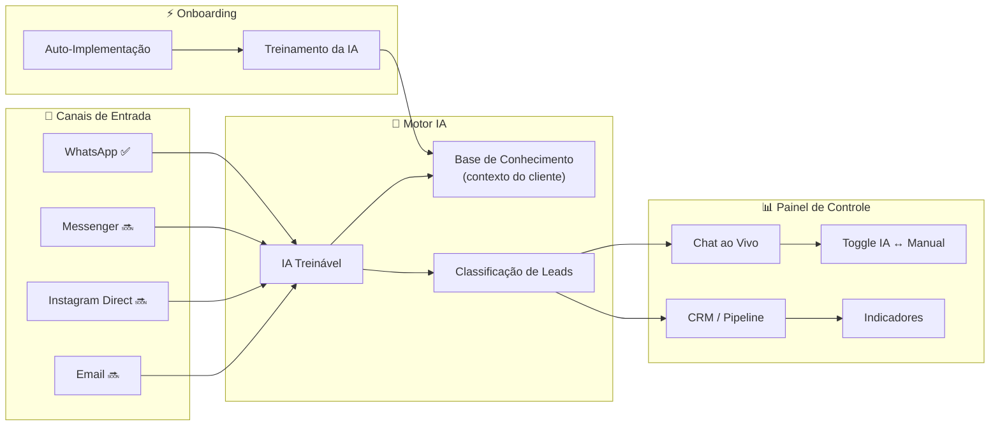
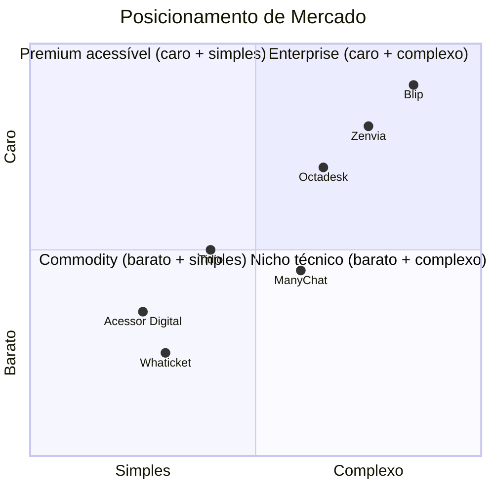
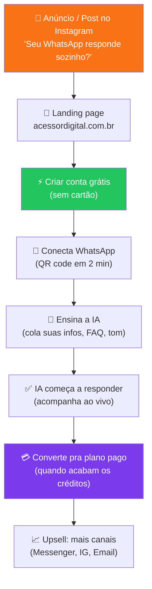

# 🧠 Acessor Digital — Planejamento Estratégico Completo

> **O que é de verdade:** Plataforma SaaS de atendimento inteligente com IA multicanal, treinável, com CRM e auto-implementação.
> **Domínio:** acessordigital.com.br

---

## 1. Visão do Produto

A Acessor Digital **não é uma agência**. É uma **plataforma de atendimento digital com IA** que qualquer negócio — do MEI à empresa — conecta e sai usando.

### O que o sistema faz (hoje e futuro)

### Funcionalidades-chave

| Área | Funcionalidade | Status | Descrição |
|------|---------------|--------|-----------|
| **Canais** | WhatsApp | ✅ Ativo | Conexão via QR code, atendimento automatizado |
| | Messenger (Facebook) | 🔜 Futuro | Mesma IA, canal do Facebook |
| | Instagram Direct | 🔜 Futuro | DMs respondidas automaticamente |
| | Email | 🔜 Futuro | Respostas e triagem de e-mails |
| **IA** | Respostas automáticas | ✅ Ativo | IA responde dúvidas comuns instantaneamente |
| | Treinamento customizado | ✅ Ativo | Alimenta contextos, info do negócio, FAQ, tom de voz |
| | Classificação de leads | ✅ Ativo | Quente / Morno / Ruído — priorização automática |
| **Painel** | Chat ao vivo | ✅ Ativo | Visualiza todas as conversas em tempo real |
| | Toggle IA ↔ Manual | ✅ Ativo | Desativa IA e assume controle a qualquer momento |
| | CRM / Pipeline | ✅ Ativo | Acompanha leads por estágio |
| | Indicadores | ✅ Ativo | Métricas de atendimento, conversão, tempo de resposta |
| **Setup** | Auto-implementação | ✅ Ativo | Cliente conecta e configura sozinho, sem técnico |

---

## 2. Público-Alvo — Dois Mundos

### 2.1 O Empresário Local (80% do volume)

> O dono de negócio que **atende no WhatsApp** e está perdendo vendas.

| Aspecto | Perfil |
|---------|--------|
| **Quem** | Dono de lanchonete, clínica, salão, loja, imobiliária, prestador de serviço |
| **Dor** | Não dá conta de responder todo mundo. Perde cliente por demora. Não tem equipe de atendimento |
| **Linguagem** | "Meu WhatsApp lota", "Perco cliente à noite", "Queria alguém pra responder por mim" |
| **O que quer** | Algo FÁCIL, BARATO, que FUNCIONE. Não quer saber de API, webhook, integração |
| **Decisão** | Rápida. Vê valor → testa → assina. Sensível a preço |
| **Canal** | Instagram, WhatsApp, indicação, Google |

### 2.2 A Empresa / Agência (20% do volume, maior ticket)

> Empresa com volume de atendimento ou agência que quer oferecer para clientes.

| Aspecto | Perfil |
|---------|--------|
| **Quem** | E-commerce, franquias, clínicas de rede, agências de marketing |
| **Dor** | Atendimento caro, inconsistente, sem dados. Quer escalar sem contratar |
| **Linguagem** | "Preciso de um CRM com IA", "Quero dados de conversão", "Multi-atendente" |
| **O que quer** | Dashboard, indicadores, controle fino, multi-canal, white-label |
| **Decisão** | Mais analítica. Quer ver demo, comparar, negociar |
| **Canal** | Google, LinkedIn, indicação, conteúdo B2B |

---

## 3. Proposta de Valor — Uma Frase pra Cada Público

### Para o empresário local:
> **"Conecta o WhatsApp. A IA responde por você. Simples assim."**

Sem instalação, sem técnico, sem complicação. Escaneia o QR code, ensina a IA sobre seu negócio, e ela começa a responder. Você acompanha tudo ao vivo e assume quando quiser.

### Para empresa/agência:
> **"Atendimento inteligente em todos os canais. Com dados, CRM e controle total."**

IA multicanal treinável, pipeline de leads, indicadores de performance, toggle de controle humano. Escale sem contratar.

### Tagline universal:
> **"Seu atendimento no automático."** ⭐

Funciona para os dois públicos. É simples, direto, e comunica o benefício core.

---

## 4. Análise Competitiva

| Concorrente | O que faz | Ponto forte | Ponto fraco | Preço aprox. |
|------------|-----------|-------------|-------------|-------------|
| **ManyChat** | Chatbot para IG/Messenger/WhatsApp | Automação de fluxos, grande comunidade | Complexo para leigos, gringo, sem CRM real | $15–45/mês |
| **Tidio** | Chat ao vivo + chatbot IA | Interface bonita, fácil | IA genérica (não treina com seu contexto), gringo | $29–59/mês |
| **Octadesk** | Atendimento omnichannel BR | Multi-canal, CRM | Caro, interface pesada, onboarding longo | R$ 200+/mês |
| **Zenvia** | CPaaS + chatbot BR | Multicanal, APIs robustas | Muito enterprise, não é pra "povão" | R$ 300+/mês |
| **Whaticket** | Multi-atendente WhatsApp | Barato, BR, WhatsApp-first | Sem IA, sem CRM real, interface básica | R$ 99/mês |
| **Blip** | Plataforma de chatbot (Take) | Robusto, enterprise | Complexo, caro, precisa de dev | Enterprise |
| **RespondeAI** | IA no WhatsApp | IA que classifica leads, simples | Só WhatsApp, novo, sem multi-canal ainda | R$ 89–129/mês |

### Onde a Acessor Digital se posiciona

> [!IMPORTANT]
> **O espaço vazio** é o quadrante inferior-esquerdo: **barato + simples**. É onde a Acessor Digital precisa dominar. Nenhum concorrente BR faz IA treinável + multicanal + CRM de forma realmente simples e acessível. É o "Nubank do atendimento digital".

---

## 5. O Funil do Cliente

### Métricas-chave do funil

| Etapa | Métrica | Meta |
|-------|---------|------|
| Anúncio → Landing | CTR | > 2% |
| Landing → Cadastro | Conversão | > 15% |
| Cadastro → Conexão WhatsApp | Ativação | > 60% |
| Conexão → Primeiro uso IA | Engajamento | > 80% |
| Free → Pago | Conversão | > 10% |
| Pago → Upsell multicanal | Expansão | > 20% |

---

## 6. Mensagens-Chave por Canal

### Instagram (atração)

| Mensagem | Público |
|----------|---------|
| "Seu WhatsApp responde sozinho. Mesmo às 3h da manhã." | Empresário local |
| "Pare de perder cliente por demora no WhatsApp." | Empresário local |
| "IA que aprende sobre SEU negócio. Não é chatbot genérico." | Ambos |
| "Conecta em 2 minutos. Sem técnico. Sem complicação." | Empresário local |
| "CRM + IA + Chat ao vivo. Tudo num lugar só." | Empresa |

### Landing page (conversão)

| Seção | O que comunica |
|-------|----------------|
| **Hero** | "Seu atendimento no automático." + CTA criar conta |
| **Como funciona** | 3 passos: Conecta → Ensina → Funciona |
| **Diferenciais** | IA treinável, auto-implementação, chat ao vivo, toggle manual |
| **Canais** | WhatsApp agora, Messenger/IG/Email em breve |
| **Casos de uso** | Restaurante, clínica, loja, imobiliária, serviços |
| **Preço** | Simples, transparente, teste grátis |
| **Prova social** | Métricas reais, depoimentos |

### WhatsApp (retenção/suporte)

O próprio sistema demonstra a si mesmo. O cliente que usa a Acessor Digital para atender **é atendido pela Acessor Digital via IA** no suporte. Meta = comer a própria comida.

---

## 7. Pilares Estratégicos da Marca

### 7.1 Facilidade radical

> "Se não dá pra configurar em 5 minutos, a gente falhou."

- Auto-implementação (o cliente faz sozinho)
- QR code → conectado → IA respondendo
- Zero jargão técnico na interface e comunicação
- Tutorial em vídeo curto, não manual de 30 páginas

### 7.2 IA que é SUA

> "Não é um chatbot burro. É uma IA que sabe tudo sobre seu negócio."

- O cliente alimenta: cardápio, preços, horários, FAQ, tom de voz
- A IA responde COM CONTEXTO, não respostas genéricas
- Diferencial BRUTAL vs ManyChat/Tidio (que são fluxos pré-programados)

### 7.3 Controle humano total

> "A IA trabalha pra você, não no lugar de você."

- Chat ao vivo: vê tudo em tempo real
- Toggle: desativa IA e assume na hora
- Classificação: sabe quem é lead quente vs ruído
- O humano decide quando entrar, com contexto completo

### 7.4 Multicanal (visão)

> "Um cérebro, todos os canais."

- Mesmo treinamento da IA serve pra WhatsApp, Messenger, IG Direct, Email
- CRM unificado: não importa de onde o lead veio
- Roadmap claro: WhatsApp agora, demais canais em breve

### 7.5 Dados e resultado

> "Atendimento virou indicador."

- Dashboard com métricas: tempo de resposta, volume, classificação
- CRM com pipeline: lead → contato → fechamento
- ROI visível: "A IA respondeu X mensagens que seriam Y horas do seu tempo"

---

## 8. Impacto na Identidade Visual

Agora que entendemos o produto de verdade, a identidade visual precisa comunicar:

| Precisa transmitir | NÃO pode parecer |
|-------------------|-------------------|
| Fácil, qualquer um usa | Complexo, "precisa ser tech" |
| Inteligente, IA de verdade | Chatbot burro, robozinho |
| Acessível, custo-benefício | Barato, amador, "mais um" |
| Multi-canal, completo | Limitado a um canal só |
| Controle humano, confiança | IA que substitui pessoas |
| Resultado, dados, ROI | Só promessas sem métricas |

### Direções visuais revisadas pós-estratégia

Agora que temos a estratégia clara, as cores precisam falar:

| Emoção necessária | Cor que entrega |
|-------------------|-----------------|
| **Facilidade** | Cores quentes, arredondamentos, espaço |
| **Inteligência** | Gradientes sutis, brilho, profundidade |
| **Acessibilidade** | Cores vibrantes, não corporativas |
| **Tecnologia** | Dark mode, neon, elementos digitais |
| **Resultado** | Verde de growth, números em destaque |
| **Confiança** | Azul/navy como base de apoio |

> [!TIP]
> **Insight-chave:** A marca precisa de **duas velocidades visuais**:
> 1. **Redes sociais / landing page** → quente, energética, popular (atrai o empresário local)
> 2. **Dashboard / produto** → dark, precisa, profissional (retém o usuário com sensação de controle)
> 
> A paleta precisa funcionar nos dois contextos. Isso aponta para uma paleta **bi-tonal**: cor quente de atração + dark mode tech no produto.

---

## 9. Decisão Pendente

> [!IMPORTANT]
> **Com esse contexto todo, qual direção visual faz mais sentido?**
> 
> Eu recomendo revisitar as 4 opções com esse novo olhar:
> - **Roxo** → "Nubank do atendimento" — democratização, inovação
> - **Verde Neon** → "PicPay do atendimento" — resultado, dinheiro, growth
> - **Laranja + Navy** → "iFood do atendimento" — energia, ação, todo mundo usa
> - **Gradiente** → "Instagram do atendimento" — multicanal, dinâmico, moderno
> 
> Ou me diz a vibe que sente e eu crio uma **5ª direção sob medida**.
