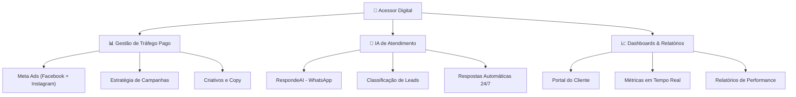

# 🚀 Acessor Digital — Planejamento de Marca & Posicionamento

> **Nova marca de agência digital** focada em tráfego pago (Meta Ads) + atendimento inteligente com IA (RespondeAI).
> Domínio: `acessordigital.com.br`

---

## 1. Análise do Produto — RespondeAI

Analisei o site [respondeai-sigma.vercel.app](https://respondeai-sigma.vercel.app/) em profundidade. Aqui está o resumo:

### O que é
Sistema SaaS de **atendimento automatizado via WhatsApp com IA** que:
- Responde mensagens repetidas automaticamente
- **Classifica leads** (quente / ruído / prioridade) em tempo real
- Notifica o humano apenas quando importa (leads quentes, intenção de compra)
- Monitora conversas ao vivo com dashboard

### Proposta de valor
> "Responda todo mundo — e foque no que dá dinheiro"

A IA filtra o ruído e prioriza quem quer comprar. Tempo médio de resposta: **12 segundos**.

### Público-alvo do produto
- E-commerce (rastreio, trocas, dúvidas)
- Imobiliárias (visitas, qualificação)
- Clínicas (agendamentos, convênios)
- Serviços em geral (orçamentos, follow-up)

### Modelo de precificação
| Plano | Preço | Economia | Créditos |
|-------|-------|----------|----------|
| Mensal | R$ 129/mês | — | 500/mês |
| Semestral | R$ 109/mês (R$ 654) | -15% | 500/mês × 6 |
| Anual | R$ 89/mês (R$ 1.068) | -31% | 500/mês × 12 |

Crédito extra: R$ 19,90–29,90 por pacote de 100. Pacotes avulsos não expiram.

### Design do site atual
- **Visual limpo e minimalista** (light theme, bordas suaves)
- Typography: **Inter** (Google Fonts)
- Stack: React + TanStack Router, Tailwind CSS, componentes shadcn/ui (Radix)
- Cards com bordas sutis, badges coloridas, accordion para FAQ
- Paleta: branco/cinza + violeta (#8B5CF6) como accent de pricing + âmbar para "Melhor Preço"

> [!IMPORTANT]
> O site do RespondeAI está clean mas **genérico**. A Acessor Digital vai se diferenciar por ter uma identidade visual **premium, tech-forward e com personalidade própria** — não apenas revendendo o SaaS, mas como marca completa de resultados digitais.

---

## 2. Definição da Marca — Acessor Digital

### Nome
**Acessor Digital** — jogo de palavras entre "assessor" (quem orienta/guia) e "acesso" (entrada ao digital). Transmite: consultoria + tecnologia + proximidade.

### Posicionamento
> **"Seu acesso ao resultado digital."**

Não é uma agência genérica. É o braço digital de negócios locais que querem:
1. **Tráfego pago que converte** (Meta Ads com gestão profissional)
2. **Atendimento inteligente** (IA no WhatsApp que nunca perde lead)
3. **Dados e resultados reais** (dashboard, métricas, transparência)

### Persona da marca
| Aspecto | Definição |
|---------|-----------|
| **Tom de voz** | Direto, confiante, sem jargão técnico desnecessário. Fala como parceiro, não como vendedor |
| **Personalidade** | Tecnológico mas acessível. Sério nos resultados, leve na comunicação |
| **Arquétipo** | O Mago (transforma realidade) + O Sábio (conhecimento e dados) |
| **Público** | Empresários locais, donos de negócio, gerentes de marketing de PMEs |
| **Diferencial** | Combina gestão de tráfego + IA de atendimento (poucos fazem os dois juntos) |

### Tagline (opções)
1. **"Seu acesso ao resultado digital."** ⭐ (principal)
2. "Tráfego + IA. Resultado real."
3. "Conectamos seu negócio ao resultado."
4. "O digital que converte."

---

## 3. Identidade Visual

### 3.1 Paleta de Cores

A paleta é **tech-forward, premium e confiável**. Azul transmite confiança e tecnologia. Ciano traz modernidade e inovação.

| Token | Hex | Uso |
|-------|-----|-----|
| **Primary Blue** | `#2563EB` | Cor principal. CTAs, links, destaques |
| **Cyan Accent** | `#06B6D4` | Accent. IA, tecnologia, inovação |
| **Navy Dark** | `#0F172A` | Backgrounds dark mode, headers |
| **Slate** | `#1E293B` | Backgrounds secundários |
| **Slate Light** | `#334155` | Bordas, divisores |
| **White** | `#F8FAFC` | Texto principal em dark, backgrounds light |
| **Gray Muted** | `#94A3B8` | Texto secundário |
| **Success Green** | `#10B981` | Indicadores positivos, conversões |
| **Warning Amber** | `#F59E0B` | Alertas, destaques de preço |
| **Gradient Hero** | `#2563EB → #06B6D4` | Gradiente principal para hero, ícones, badges premium |

> [!TIP]
> A paleta foi pensada para funcionar em **dark mode** (redes sociais, dashboards) e **light mode** (materiais impressos, site clean).

### 3.2 Tipografia

| Uso | Fonte | Peso |
|-----|-------|------|
| **Headlines** | **Outfit** (Google Fonts) | 600–700 |
| **Body text** | **Inter** (Google Fonts) | 400–500 |
| **Código/dados** | **JetBrains Mono** | 400 |

> Outfit é moderna, geométrica e premium. Inter é a padrão do mercado tech para legibilidade.

### 3.3 Logo

#### Conceito: Versão Light (fundo claro)


#### Conceito: Versão Dark (fundo escuro)


#### Ícone / Avatar para Redes Sociais


#### Capa para Redes Sociais


> [!NOTE]
> Estes são **conceitos iniciais** gerados por IA. Se quiser, posso gerar variações com diferentes estilos de ícone (mais geométrico, mais orgânico, com ou sem monograma "AD", etc.). Para a versão final vetorizada (SVG/AI), recomendo refinar com base no conceito que mais agradou.

---

## 4. Estratégia de Redes Sociais

### 4.1 Instagram

#### Bio
```
🚀 Acessor Digital
Tráfego Pago + IA de Atendimento
📊 Resultados reais para seu negócio
🤖 Atendimento 24h com IA no WhatsApp
⬇️ Fale com a gente
```

#### Destaques (Stories fixos)
| Ícone | Nome | Conteúdo |
|-------|------|----------|
| 📊 | **Resultados** | Cases de clientes, prints de métricas, antes/depois |
| 🤖 | **IA** | Como funciona o atendimento IA, demos, prints do dashboard |
| 💰 | **Planos** | Pricing, comparativos, benefícios de cada plano |
| ❓ | **FAQ** | Perguntas frequentes respondidas em stories |
| 🎯 | **Tráfego** | Bastidores de campanhas, dicas de Meta Ads |
| 🏆 | **Clientes** | Depoimentos, feedbacks |

#### Pilares de Conteúdo
1. **Educativo (40%)** — Dicas de tráfego pago, como IA ajuda no atendimento, erros comuns
2. **Prova social (25%)** — Cases, métricas reais, depoimentos
3. **Bastidores (20%)** — Day-to-day da agência, mostrando dashboards, análises
4. **Oferta (15%)** — CTAs para consultoria, demonstração do RespondeAI

#### Hashtags principais
```
#trafegopago #marketingdigital #metaads #ianowhatsapp 
#acessordigital #gestaodetrafego #anunciosonline
#facebookads #instagramads #resultadosreais
#inteligenciaartificial #atendimentodigital #leads
#vendasonline #negocioslocais #empreendedorismo
```

### 4.2 Facebook

#### Página
- **Nome:** Acessor Digital
- **Categoria:** Agência de publicidade/marketing digital
- **Sobre:** "Agência especializada em tráfego pago (Meta Ads) e atendimento inteligente com IA. Seu acesso ao resultado digital."
- **CTA principal:** "Enviar mensagem" (WhatsApp)

---

## 5. Calendário de Conteúdo — Semana Inaugural

### Semana 1: Lançamento

| Dia | Formato | Conteúdo | Pilar |
|-----|---------|----------|-------|
| **Seg** | Carrossel | "O que é a Acessor Digital?" — apresentação da marca, serviços, diferencial | Institucional |
| **Ter** | Reels | "Você sabia que 73% dos leads são perdidos por demora no atendimento?" — gancho IA | Educativo |
| **Qua** | Single + Story | "Tráfego pago + IA: a combinação que ninguém está fazendo" — posicionamento | Educativo |
| **Qui** | Carrossel | "Como a IA responde seus clientes em 12 segundos" — tutorial visual do RespondeAI | Educativo |
| **Sex** | Reels | "Parei de perder clientes no WhatsApp" — storytelling sobre o problema vs solução | Prova social |
| **Sáb** | Story | Bastidores: criando a primeira campanha para um cliente | Bastidores |
| **Dom** | Single | "Seu negócio merece um atendimento 24h" — CTA para consultoria gratuita | Oferta |

---

## 6. Tom de Comunicação — Exemplos

### ❌ Evitar
- "Somos a melhor agência do mercado" (arrogante)
- "Revolucionamos o marketing digital" (clichê)
- "CPM, CTR, ROAS, CPC..." sem explicar (jargão técnico puro)

### ✅ Usar
- "Seu cliente mandou mensagem às 2h da manhã. A IA respondeu em 12 segundos. Você dormiu tranquilo." (storytelling)
- "Tráfego sem atendimento é jogar dinheiro fora. A gente cuida dos dois." (direto e diferenciado)
- "Resultados reais. Sem PowerPoint bonito que não vira venda." (autêntico)

---

## 7. Arquitetura de Serviços



### Pacotes sugeridos (a definir pricing)

| Pacote | Inclui | Para quem |
|--------|--------|-----------|
| **Starter** | Gestão de tráfego básica (1 campanha) + dashboard | Negócios começando com ads |
| **Growth** | Tráfego completo + RespondeAI (500 créditos) + relatórios | Negócios com volume de leads |
| **Scale** | Tráfego + IA + consultoria estratégica + criativos | Negócios em expansão |

---

## 8. Próximos Passos

- [ ] **Aprovar paleta de cores e estilo de logo** — escolher o conceito preferido ou pedir variações
- [ ] **Criar contas de redes sociais:**
  - [ ] Instagram: @acessordigital
  - [ ] Facebook Page: Acessor Digital
- [ ] **Configurar domínio** acessordigital.com.br (DNS + hosting)
- [ ] **Definir pricing** dos pacotes de serviço
- [ ] **Produzir primeiros posts** para o calendário da semana inaugural
- [ ] **Conectar RespondeAI** como produto de atendimento dentro da oferta
- [ ] **Configurar Business Manager** do Meta para gestão de anúncios dos clientes

---

## 9. Decisões Pendentes

> [!IMPORTANT]
> **Preciso da sua opinião sobre:**
> 1. O estilo de logo te agradou? Quer mais geométrico, mais minimalista, ou com outro ícone?
> 2. A paleta azul/ciano está ok ou prefere outra direção de cor?
> 3. A tagline "Seu acesso ao resultado digital" soa bem?
> 4. O nome de usuário do Instagram vai ser `@acessordigital` ou alguma variação?
> 5. Vai usar o RespondeAI como produto white-label (marca da Acessor Digital) ou com a marca própria dele?
